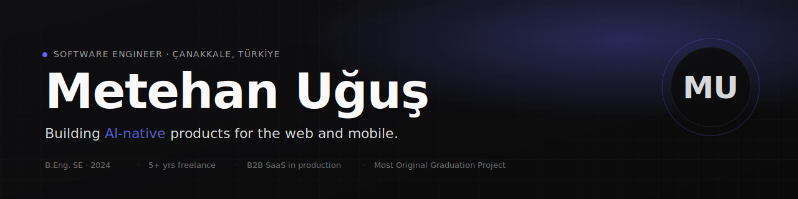
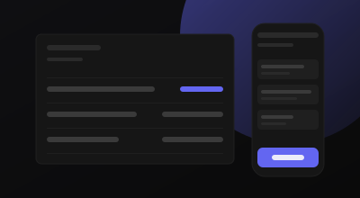
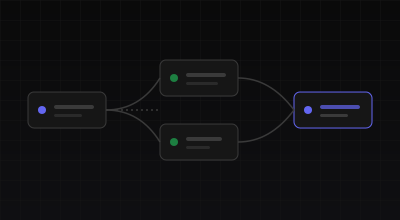

  

<!-- ============ INTRO ROW ============ -->

  <a href="https://metehanugus.com"><strong>metehanugus.com</strong></a>
  &nbsp;·&nbsp;
  <a href="https://metehanugus.com/work/asansoft">Asansoft</a>
  &nbsp;·&nbsp;
  <a href="https://metehanugus.com/notes">Notes</a>
  &nbsp;·&nbsp;
  <a href="https://metehanugus.com/cv.pdf">CV (PDF)</a>
  &nbsp;·&nbsp;
  <a href="https://www.linkedin.com/in/metehanugus">LinkedIn</a>

  Open to senior full-stack roles, partnerships, and select freelance.

  

## Currently

- **[Asansoft](https://metehanugus.com/work/asansoft)** — B2B SaaS for elevator maintenance firms in Türkiye. iOS, Android, web on a single Postgres + Supabase stack. **20+ active companies**, **~10K inspection records/month**.
- **Sync conflict UX v2** — moving Asansoft from last-write-wins to optimistic concurrency with diff merge.
- **AI-native automations** — n8n self-host, Claude Code + Cursor in the daily loop.

  

## Selected work

<table width="100%">
  <tr>
    <td width="50%" valign="top">
      
      <h3><a href="https://metehanugus.com/work/asansoft">Asansoft</a></h3>
      

        Production B2B SaaS for Turkish elevator maintenance firms. Offline-first
        mobile + web on a single Postgres + Supabase stack. 20+ active firms,
        ~$30/mo infra cost.
      

      

        <code>React Native</code> <code>Next.js</code> <code>PostgreSQL</code> <code>Supabase</code>
      

    </td>
    <td width="50%" valign="top">
      
      <h3><a href="https://metehanugus.com/notes/04-game-of-yu-postmortem">Game of YU</a></h3>
      

        AI-driven RPG with ChatGPT-driven NPCs and ElevenLabs voice cloning.
        Yaşar University Software Engineering graduation project. <strong>Most Original
        Graduation Project</strong> award, 2024.
      

      

        <code>Unity</code> <code>C#</code> <code>OpenAI</code> <code>ElevenLabs</code>
      

    </td>
  </tr>
  <tr>
    <td width="50%" valign="top">
      
      <h3><a href="https://metehanugus.com/notes/02-n8n-vs-make">n8n client automations</a></h3>
      

        Operational automations for anonymous SMB clients — n8n self-host with
        Sheets / Stripe / Notion integrations. Saved one client ~12 hours/week
        of manual reconciliation.
      

      

        <code>n8n</code> <code>TypeScript</code> <code>Postgres</code> <code>Stripe</code>
      

    </td>
    <td width="50%" valign="top">
      
      <h3><a href="https://metehanugus.com">metehanugus.com</a></h3>
      

        This site. Server-side i18n with /tr URL prefix, MDX content via Velite,
        View Transitions, edge OG images. Build/lint/typecheck green.
      

      

        <code>Next.js 16</code> <code>React 19</code> <code>Tailwind v4</code> <code>Velite</code>
      

    </td>
  </tr>
</table>

  

## Stack

  
  
  
  
  

  
  
  
  
  
  
  

  
  
  
  
  
  
  

  

## Activity

> Most of my day-to-day work happens in private repositories. The streak count below includes private contributions (the public profile setting is on). The graph shows public commits only — actual activity is roughly 3–4x what you see here.

  
  
  

  

  

  

  

## Writing

I publish engineering deep-dives, AI-native development notes, and reflections on running a one-person practice from Türkiye at **[metehanugus.com/notes](https://metehanugus.com/notes)**. RSS at [/rss.xml](https://metehanugus.com/rss.xml).

## Where to find me

  
  
  
  

This README's source: <a href="https://metehanugus.com">metehanugus.com</a> repo, under <code>docs/github-profile-readme.md</code>. SVG visuals checked into <code>assets/</code> alongside this file.
